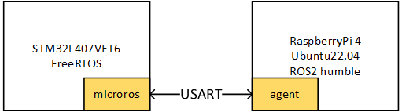

# microros-test
microros通信测试

 - microros平台：STM32F407VET6
 - ros2平台：RaspberryPi 4B 8G(Ubuntu 22.04 Sever)
 - ros2版本：humble
 - [ros-agent](https://github.com/micro-ROS/micro_ros_setup.git)

## STM32

外设分配：

- usart1: 与树莓派通信
- usart3: 调试串口
- PD13: 运行指示灯

## 问题记录

1. 编译下载时如果不使用代理则很容易失败，建议使用小鱼的[一键安装](https://fishros.com/install/install1s/docs/index.html)包括rosdepc
2. rclc_support_init() 失败
    先启动树莓派端代理，STM32端的ros任务再进行初始化

## Refer

1. [stm32_micro_ros_setup](https://github.com/lFatality/stm32_micro_ros_setup.git) [video](https://youtu.be/xbWaHARjSmk)

2. [micro-ROS](https://github.com/micro-ROS)

## 调试记录

**测试listener节点是否正常**

**测试STM32与树莓派通过microros通信**

**STM32调试串口接收数据**

当在ROS端终止agent时就会出现Error publishing

